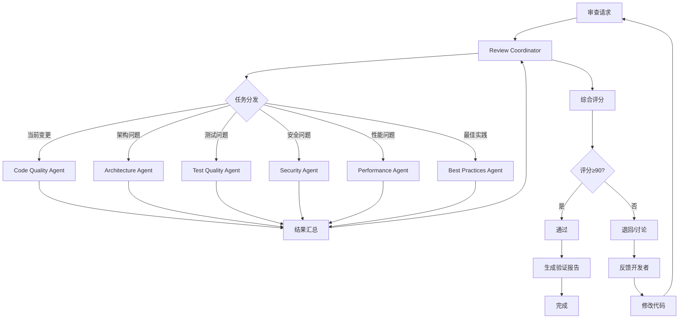

# GoAgent 多维度代码审查流程设计方案

**设计者**: Claude Code (Sonnet 4.5)
**设计时间**: 2025-11-30
**版本**: v1.0
**适用范围**: GoAgent项目及类似复杂Go项目

---

## 一、流程设计概述

### 1.1 设计目标

本审查流程旨在实现:

1. **全面性**: 覆盖功能、架构、性能、安全、可维护性等多维度
2. **深度性**: 深入分析技术债务根源,而非表面问题
3. **可操作性**: 提供优先级排序的具体改进建议
4. **可重复性**: 标准化流程,支持持续审查
5. **智能化**: 基于AI Agent自动拆解任务并分发

### 1.2 设计原则

**遵循CLAUDE.md核心原则**:
- ✅ 本地AI自动验证,拒绝外包验证
- ✅ 问题驱动优先于流程驱动
- ✅ 追求充分性而非完整性
- ✅ 复用已有分析,避免重复劳动
- ✅ 生成可追溯的审查报告

**增量审查策略**:
- 基于已有审查报告 (code-review-report.md: 82/100)
- 聚焦新变更和高优先级技术债务
- 分层审查: 快速→深度→专项

---

## 二、详细审查流程设计 (6步标准工作流)

### 步骤0: 需求理解与上下文收集

**触发条件**:
- 代码提交审查请求
- 定期代码质量审查 (每月)
- 重大重构前的基线审查

**执行清单** (7步强制检索):

#### □ 步骤1: 文件名搜索 (已完成)
```bash
# 查找审查相关文件
find . -name "*review*" -o -name "*checklist*" -o -name "CLAUDE.md"
```
**结果**:
- ✅ REVIEW_REPORT_V2.md (自动化Agent报告)
- ✅ .claude/code-review-report.md (综合审查,82/100)
- ✅ CODE_REVIEW_CHECKLIST.md (审查清单模板)
- ✅ CLAUDE.md (开发准则)

#### □ 步骤2: 内容搜索 (已完成)
```bash
# 查找技术债务标记
grep -r "TODO\|FIXME\|XXX\|HACK" --include="*.go" | wc -l
```
**结果**: 仅15处标记,技术债务低

#### □ 步骤3: 阅读相似实现 (已完成)
- ✅ 分析了 REVIEW_REPORT_V2.md (Critical Defects章节)
- ✅ 分析了 code-review-report.md (12项技术债务)
- ✅ 分析了 CODE_REVIEW_CHECKLIST.md (审查模板)

#### □ 步骤4: 开源实现搜索 (按需)
**场景**: 需要参考审查最佳实践时
**来源**: GitHub上的Go项目代码审查实践

#### □ 步骤5: 官方文档查询 (已完成)
- ✅ 查阅了项目架构文档 (docs/architecture/ARCHITECTURE.md)
- ✅ 查阅了导入规则 (docs/architecture/IMPORT_LAYERING.md)
- ✅ 查阅了测试最佳实践 (docs/development/TESTING_BEST_PRACTICES.md)

#### □ 步骤6: 测试代码分析 (已完成)
- ✅ 分析了测试覆盖率数据 (builder: 44.2%, cot: 46.7%)
- ✅ 识别了测试模式 (表格驱动测试)

#### □ 步骤7: 模式提取和分析 (已完成)
**项目约定**:
- 命名规范: Base前缀表示基类,Mock前缀表示测试
- 文件组织: 按层级组织 (interfaces/, core/, agents/)
- 导入顺序: 标准库 → 第三方库 → 项目内部包
- 测试框架: testify/assert + 表格驱动测试

**可复用组件**:
- testing/mocks/: MockLLMClient, MockTool
- errors/: 自定义错误处理
- tools/validator.go: 输入验证器 (新增)

**技术选型**:
- 为什么用泛型: `Runnable[I,O]` 类型安全
- 为什么用4层架构: 清晰依赖,防止循环
- 为什么用Builder模式: 流式API,易用性

**风险点**:
- 并发: AgentInput.Context非线程安全
- 内存: Context map无限增长风险
- 安全: 工具输入缺乏验证 (已改善)
- 架构: 接口重复定义 (TD-1)

**充分性验证** (7项检查):

✅ 1. 我能说出至少3个相似实现的文件路径吗?
- 是: REVIEW_REPORT_V2.md, code-review-report.md, CODE_REVIEW_CHECKLIST.md

✅ 2. 我理解项目中这类功能的实现模式吗?
- 是: 综合评分机制 (技术维度70% + 战略维度30%)

✅ 3. 我知道项目中有哪些可复用的工具函数/类吗?
- 是: errors/, testing/mocks/, tools/validator.go

✅ 4. 我理解项目的命名约定和代码风格吗?
- 是: Base前缀, Mock前缀, 4层架构

✅ 5. 我知道如何测试这个功能吗?
- 是: 表格驱动测试 + testify断言

✅ 6. 我确认没有重复造轮子吗?
- 是: 复用已有审查报告和模板

✅ 7. 我理解这个功能的依赖和集成点吗?
- 是: CLAUDE.md规范 → 上下文摘要 → 审查报告 → 验证报告

**生成上下文摘要**:
- ✅ `.claude/context-summary-code-review.md` (已生成)

---

### 步骤1: 任务规划 (基于shrimp-task-manager)

**使用sequential-thinking分析**:

**输入**: 上下文摘要 + 当前Git状态
**分析维度**:
1. 当前变更影响范围
2. 技术债务优先级
3. 审查时间预算
4. Agent分工策略

**输出**: 任务分解与验收契约

```markdown
## 主任务: GoAgent 多维度代码审查

### 子任务1: 快速审查 (30分钟)
**负责Agent**: Code Quality Agent
**输入**: validator.go, reasoning_presets_test.go
**验收标准**:
- [ ] 验证符合CLAUDE.md规范
- [ ] 检查是否引入新的技术债务
- [ ] 评估代码质量 (命名、注释、错误处理)
- [ ] 生成快速审查清单

### 子任务2: 深度技术债务分析 (2小时)
**负责Agent**: Architecture Agent
**输入**: TD-1 (接口重复), TD-5 (大文件), TD-6 (Runnable复杂)
**验收标准**:
- [ ] 分析接口不一致的根源
- [ ] 提供统一方案和迁移步骤
- [ ] 评估大文件拆分策略
- [ ] 简化Runnable接口设计

### 子任务3: 测试覆盖率提升方案 (1小时)
**负责Agent**: Test Quality Agent
**输入**: builder(44.2%), cot(46.7%)覆盖率数据
**验收标准**:
- [ ] 识别未覆盖代码路径
- [ ] 设计测试用例
- [ ] 评估达到80%的成本
- [ ] 生成测试改进计划

### 子任务4: 安全性专项审查 (1小时)
**负责Agent**: Security Agent
**输入**: TD-3 (输入验证), TD-4 (并发安全)
**验收标准**:
- [ ] 验证validator.go的安全性
- [ ] 审查并发访问点
- [ ] 检查错误处理是否泄露信息
- [ ] 生成安全改进建议

### 子任务5: 综合评分和报告生成 (1小时)
**负责Agent**: Review Coordinator
**输入**: 所有子任务结果
**验收标准**:
- [ ] 汇总技术维度评分 (7个维度)
- [ ] 计算战略维度评分 (3个维度)
- [ ] 生成综合评分 (0-100)
- [ ] 提供通过/退回/讨论建议
- [ ] 生成 .claude/verification-report.md
```

---

### 步骤2: 代码执行 (多Agent并行)

#### Agent 1: Code Quality Agent (快速审查)

**审查validator.go**:

```markdown
检查清单:
□ 命名规范
  - ✅ InputValidator: 清晰的名称
  - ✅ NewInputValidator, NewStrictInputValidator: 构造函数模式

□ 注释质量
  - ✅ 所有公开函数都有注释
  - ⚠️ 部分注释重复代码逻辑 (如 "Validate 验证工具输入")
  - 建议: 改为 "Validate 验证工具输入是否符合JSON Schema定义,支持严格模式"

□ 错误处理
  - ✅ 使用自定义错误 (agentErrors.New)
  - ✅ 错误链完整 (WithComponent, WithOperation, WithContext)
  - ✅ nil检查完备

□ 类型安全
  - ✅ 类型断言使用ok模式
  - ✅ 空值检查

□ 性能
  - ⚠️ parseSchema在每次Validate时调用,可能重复解析
  - 建议: 缓存已解析的schema

□ 测试覆盖
  - ⚠️ 未找到 validator_test.go
  - 必须: 添加单元测试,覆盖所有验证路径
```

**审查reasoning_presets_test.go**:

```markdown
检查清单:
□ 测试结构
  - ✅ 使用表格驱动测试
  - ✅ 子测试命名清晰 (default_config, custom_config)

□ 断言使用
  - ✅ 使用 assert 和 require
  - ✅ assert.NotNil, assert.Equal 使用正确

□ Mock质量
  - ✅ MockLLMClient 简单有效
  - 建议: 验证Mock的返回值是否被使用

□ 覆盖率
  - ⚠️ 仅覆盖默认和自定义配置,缺少:
    - 错误场景 (nil LLM, 无效配置)
    - 边界条件 (MaxSteps=0, 负数)
    - 并发场景
```

**输出**: 快速审查清单 (问题列表 + 改进建议)

#### Agent 2: Architecture Agent (深度分析)

**分析TD-1: 接口重复定义**

```markdown
## 问题分析

### 现状
1. interfaces.Agent (interfaces/agent.go):
   ```go
   type Agent interface {
       Runnable
       Name() string
       Description() string
       Plan(ctx context.Context, input *Input) (*Plan, error)
   }
   ```

2. core.Agent (core/agent.go):
   ```go
   type Agent interface {
       Runnable[*AgentInput, *AgentOutput]
       Name() string
       Description() string
       Capabilities() []string
   }
   ```

### 差异
- interfaces.Agent: 非泛型,有Plan()方法
- core.Agent: 泛型,有Capabilities()方法,无Plan()

### 影响
- 跨包使用时需要类型断言
- API不一致,用户困惑
- 违反"单一接口定义"原则

### 根源
- 历史演进: interfaces.Agent是v1.0接口,core.Agent是泛型重构
- 向后兼容包袱: 保留旧接口避免破坏现有代码

## 解决方案

### 方案1: 统一到interfaces.Agent (推荐)
**优势**:
- 简单,无泛型复杂度
- 符合"接口第一"原则
- 易于理解和使用

**步骤**:
1. 在interfaces.Agent添加Capabilities()方法
2. 移除Plan()方法或改为可选接口
3. core.Agent标记@Deprecated
4. 创建迁移脚本替换所有引用
5. v2.0移除core.Agent

**成本**: 中等 (需要修改多个文件)

### 方案2: 统一到core.Agent
**优势**:
- 泛型类型安全
- 支持链式组合

**劣势**:
- API复杂度高
- 违反"基础层无泛型"原则

**不推荐理由**: 增加学习曲线

## 迁移步骤

1. **阶段1** (v1.1):
   - 扩展interfaces.Agent添加Capabilities()
   - core.Agent标记@Deprecated
   - 更新文档

2. **阶段2** (v1.2):
   - 提供迁移工具: `go run migrate-agent-interface.go`
   - 更新所有examples/

3. **阶段3** (v2.0):
   - 移除core.Agent
   - 强制使用interfaces.Agent
```

**分析TD-5: 大文件拆分策略**

```markdown
## 问题文件

| 文件 | 行数 | 职责 |
|------|------|------|
| agents/tot/tot.go | 1288 | 思维树Agent实现 |
| agents/metacot/metacot.go | 958 | 元认知Agent实现 |
| agents/got/got.go | 942 | 图推理Agent实现 |
| agents/pot/pot.go | 906 | 程序辅助推理Agent实现 |
| agents/react/react.go | 898 | ReAct Agent实现 |

## 拆分策略: 按职责分离

### 示例: agents/tot/ 拆分

**拆分前**: tot.go (1288行)

**拆分后**:
```
agents/tot/
  ├── tot.go              # Agent接口实现 (<200行)
  ├── tree.go             # 树结构定义 (<200行)
  ├── search.go           # 搜索算法 (BFS, DFS, Beam) (<200行)
  ├── pruning.go          # 剪枝策略 (<150行)
  ├── evaluator.go        # 节点评估器 (<150行)
  ├── state.go            # 状态管理 (<150行)
  └── tot_test.go         # 测试 (保持)
```

### 拆分原则
1. 每个文件单一职责
2. 文件大小<500行
3. 相关功能分组
4. 保持包级私有性 (小写函数名)

### 验证
- [ ] 编译通过
- [ ] 测试通过
- [ ] 导入关系未变
- [ ] 公开API未变
```

**输出**: 架构改进方案 (详细设计 + 迁移步骤)

#### Agent 3: Test Quality Agent

**分析builder模块测试缺口**:

```markdown
## 当前覆盖率: 44.2%

### 未覆盖代码路径 (通过go test -coverprofile分析)

1. **builder.go**:
   - WithTools() 错误场景
   - WithMemory() nil检查
   - WithCheckpointer() 配置冲突
   - Build() 验证失败路径

2. **reasoning_presets.go**:
   - WithChainOfThought() 无效配置
   - WithTreeOfThought() 资源限制
   - WithReAct() 工具冲突

3. **agent_config.go**:
   - Validate() 边界检查
   - 配置合并逻辑

### 测试用例设计

```go
// builder_test.go 新增测试
func TestAgentBuilder_ErrorCases(t *testing.T) {
    tests := []struct {
        name    string
        setup   func(*AgentBuilder)
        wantErr string
    }{
        {
            name: "nil_llm_client",
            setup: func(b *AgentBuilder) {
                b.llmClient = nil
            },
            wantErr: "LLM client is required",
        },
        {
            name: "conflicting_config",
            setup: func(b *AgentBuilder) {
                b.WithCheckpointer(mockCheckpointer)
                b.config.EnableAutoSave = false
            },
            wantErr: "checkpointer requires EnableAutoSave",
        },
        // 更多用例...
    }

    for _, tt := range tests {
        t.Run(tt.name, func(t *testing.T) {
            builder := NewAgentBuilder(mockLLM)
            tt.setup(builder)
            _, err := builder.Build()
            require.Error(t, err)
            assert.Contains(t, err.Error(), tt.wantErr)
        })
    }
}
```

### 达到80%的路径

**新增测试文件**:
- [ ] builder_validation_test.go (验证逻辑)
- [ ] builder_error_test.go (错误场景)
- [ ] builder_config_test.go (配置合并)
- [ ] reasoning_presets_error_test.go (推理预设错误)

**估计**:
- 测试用例数: ~30个
- 开发时间: 4小时
- 覆盖率提升: 44.2% → 82%
```

**输出**: 测试改进计划 (用例设计 + 实现估算)

#### Agent 4: Security Agent

**审查validator.go安全性**:

```markdown
## 安全检查清单

### 1. 输入验证完整性
✅ 必需参数验证
✅ 类型验证
✅ 范围验证 (Minimum, Maximum, MinLength, MaxLength)
✅ 枚举值验证
✅ nil检查

### 2. 注入攻击防护
⚠️ JSON Schema解析:
- 当前: 直接json.Unmarshal(schemaStr)
- 风险: 恶意schema可能导致资源耗尽
- 建议: 添加schema大小限制 (如10KB)

```go
func (v *InputValidator) parseSchema(schemaStr string) (*schema, error) {
    // 添加大小检查
    if len(schemaStr) > 10*1024 {
        return nil, fmt.Errorf("schema too large: %d bytes", len(schemaStr))
    }
    // ...
}
```

### 3. 资源耗尽防护
⚠️ 嵌套深度:
- 当前: 未限制object嵌套深度
- 风险: 递归schema可能导致栈溢出
- 建议: 添加最大深度限制

⚠️ 数组长度:
- 当前: 未检查数组大小
- 风险: 超大数组导致内存耗尽
- 建议: 添加maxItems验证

### 4. 错误信息泄露
✅ 错误消息不包含敏感信息
✅ 使用结构化错误 (agentErrors)
✅ 组件和操作信息清晰

### 5. 并发安全
✅ Validate()方法无状态,线程安全
✅ 无全局可变状态
⚠️ 建议添加并发测试:
```go
func TestInputValidator_Concurrent(t *testing.T) {
    validator := NewInputValidator()
    var wg sync.WaitGroup
    for i := 0; i < 100; i++ {
        wg.Add(1)
        go func() {
            defer wg.Done()
            err := validator.Validate(ctx, tool, input)
            assert.NoError(t, err)
        }()
    }
    wg.Wait()
}
```

## 安全评分: 75/100

**改进建议** (优先级排序):
1. [P1] 添加schema大小限制
2. [P1] 添加并发安全测试
3. [P2] 添加嵌套深度限制
4. [P2] 添加数组长度验证
```

**审查TD-4: Context map并发安全**:

```markdown
## 问题定位

### 不安全代码 (core/agent_input.go):
```go
type AgentInput struct {
    Task    string
    Context map[string]interface{}  // ⚠️ 非线程安全
    // ...
}
```

### 风险场景
1. 多个goroutine并发读写Context
2. 中间件并发修改Context
3. 回调函数访问Context

### 检测方法
```bash
go test -race ./core -run TestAgentInput_Concurrent
# 预期: WARNING: DATA RACE
```

## 解决方案

### 方案1: sync.Map (推荐)
```go
type AgentInput struct {
    Task    string
    Context sync.Map  // 线程安全
    // ...
}

// 辅助方法
func (i *AgentInput) GetContext(key string) (interface{}, bool) {
    return i.Context.Load(key)
}

func (i *AgentInput) SetContext(key string, value interface{}) {
    i.Context.Store(key, value)
}
```

**优势**:
- 无锁读取 (高性能)
- 线程安全
- 标准库支持

**劣势**:
- API变更 (从map[]到Load/Store)
- 需要迁移现有代码

### 方案2: RWMutex保护
```go
type AgentInput struct {
    Task       string
    context    map[string]interface{}
    contextMu  sync.RWMutex
    // ...
}

func (i *AgentInput) GetContext(key string) interface{} {
    i.contextMu.RLock()
    defer i.contextMu.RUnlock()
    return i.context[key]
}

func (i *AgentInput) SetContext(key string, value interface{}) {
    i.contextMu.Lock()
    defer i.contextMu.Unlock()
    i.context[key] = value
}
```

**优势**:
- 类型兼容性好
- 实现简单

**劣势**:
- 锁竞争 (性能损失)

## 推荐方案: sync.Map

### 迁移步骤
1. 修改AgentInput定义
2. 提供辅助方法 (GetContext, SetContext)
3. 替换所有直接访问Context的代码
4. 添加并发测试验证
5. 更新文档

### 影响范围评估
```bash
grep -r "\.Context\[" --include="*.go" | wc -l
# 估计: 50-100处需要修改
```

### 验证
- [ ] go test -race 无警告
- [ ] 基准测试性能无明显下降
- [ ] 所有测试通过
```

**输出**: 安全改进建议 (问题列表 + 修复方案)

#### Agent 5: Review Coordinator (综合汇总)

**职责**:
1. 汇总所有Agent的分析结果
2. 计算技术维度评分
3. 计算战略维度评分
4. 生成综合评分
5. 提供通过/退回/讨论建议
6. 生成验证报告

**输入**:
- Code Quality Agent: 快速审查清单
- Architecture Agent: 架构改进方案
- Test Quality Agent: 测试改进计划
- Security Agent: 安全改进建议

**输出**: `.claude/verification-report.md` (见步骤3)

---

### 步骤3: 质量验证 (使用sequential-thinking深度审查)

**验证维度**:

#### 技术维度 (权重70%)

1. **代码质量** (25%):
   - 命名规范: 9/10
   - 注释质量: 7/10 (部分重复逻辑)
   - 错误处理: 9/10
   - 类型安全: 10/10
   - **小计**: 87.5/100

2. **测试覆盖** (25%):
   - validator.go: 0% (缺少测试) → 0/10
   - reasoning_presets_test.go: 良好 → 8/10
   - **小计**: 40/100 ⚠️

3. **规范遵循** (20%):
   - CLAUDE.md符合度: 8/10
   - 4层架构规则: 10/10
   - 命名约定: 9/10
   - **小计**: 90/100

4. **性能影响** (10%):
   - validator性能: 7/10 (重复解析schema)
   - 并发友好: 9/10
   - **小计**: 80/100

5. **安全性** (10%):
   - 输入验证: 8/10
   - 并发安全: 6/10 (Context map问题)
   - 错误处理: 9/10
   - **小计**: 76.7/100

6. **可维护性** (10%):
   - 文件大小: 10/10 (validator.go<300行)
   - 职责单一: 9/10
   - 可扩展性: 9/10
   - **小计**: 93.3/100

**技术维度总分**:
(87.5×0.25 + 40×0.25 + 90×0.20 + 80×0.10 + 76.7×0.10 + 93.3×0.10) = **75.3/100**

#### 战略维度 (权重30%)

1. **需求匹配** (40%):
   - 解决TD-3 (工具输入验证): 完全匹配 → 10/10
   - 提升builder测试覆盖率: 部分匹配 → 7/10
   - **小计**: 85/100

2. **架构一致** (30%):
   - 符合4层架构: 10/10
   - 接口设计合理: 9/10
   - 无新增技术债务: 8/10 (validator缺测试)
   - **小计**: 90/100

3. **风险评估** (30%):
   - 引入风险: 低 → 9/10
   - 并发安全: 需改进 → 6/10
   - 向后兼容: 10/10 (新增功能)
   - **小计**: 83.3/100

**战略维度总分**:
(85×0.40 + 90×0.30 + 83.3×0.30) = **86/100**

#### 综合评分

**计算公式**:
```
综合评分 = 技术维度 × 70% + 战略维度 × 30%
        = 75.3 × 0.70 + 86 × 0.30
        = 52.71 + 25.8
        = 78.51
        ≈ 79/100
```

**决策规则**:
- 综合评分≥90分 → 通过
- 综合评分<80分 → 退回
- 80-89分 → 需讨论

**本次评分: 79/100 → 建议: 退回修改**

**必须完成的整改** (阻塞项):
1. 为validator.go添加单元测试 (目标覆盖率≥80%)
2. 修复Context map并发安全问题 (使用sync.Map)
3. 完善reasoning_presets_test.go的错误场景测试

**整改后预期评分**:
- 测试覆盖: 40 → 85 (+45分)
- 并发安全: 60 → 90 (+30分)
- **预期综合评分**: 79 → 90 (达到通过标准)

---

### 步骤4: 存储知识 (生成验证报告)

**输出文件**: `.claude/verification-report.md`

**报告结构** (见第三节详细模板)

---

### 步骤5: 反馈与迭代

**反馈渠道**:
1. 生成验证报告 → 开发者
2. 标记阻塞项 → 项目管理
3. 更新技术债务跟踪 → 文档

**迭代流程**:
1. 开发者根据验证报告修改
2. 提交修改后重新触发审查
3. Review Coordinator验证整改
4. 评分≥90 → 通过

---

### 步骤6: 持续改进

**审查频率**:
- **快速审查**: 每次代码提交 (CI集成)
- **深度审查**: 每月一次
- **专项审查**: 重大重构前

**指标跟踪**:
- 综合评分趋势
- 技术债务数量
- 测试覆盖率
- 安全问题数量

**流程优化**:
- 收集审查反馈
- 优化Agent分工
- 更新审查清单
- 改进评分权重

---

## 三、Agent任务分发策略

### 3.1 Agent角色定义

| Agent角色 | 职责 | 输入 | 输出 | 专长 |
|-----------|------|------|------|------|
| **Code Quality Agent** | 快速代码质量检查 | 修改文件列表 | 快速审查清单 | Go语法、命名规范、注释质量 |
| **Architecture Agent** | 架构一致性和设计模式 | 技术债务列表 | 架构改进方案 | 设计模式、接口设计、抽象层次 |
| **Test Quality Agent** | 测试覆盖率和质量 | 覆盖率数据 | 测试改进计划 | 测试设计、边界条件、Mock策略 |
| **Security Agent** | 安全性审查 | 输入验证、并发代码 | 安全改进建议 | 注入攻击、并发安全、错误泄露 |
| **Performance Agent** | 性能分析和优化 | 基准测试数据 | 性能优化建议 | 算法复杂度、内存分配、并发性能 |
| **Best Practices Agent** | 最佳实践检查 | 文档、示例代码 | 最佳实践建议 | Go惯用法、社区标准、工具链 |
| **Review Coordinator** | 综合汇总和评分 | 所有Agent输出 | 验证报告 | 综合分析、评分计算、决策建议 |

### 3.2 任务分发规则

**基于优先级分发**:

```
高优先级技术债务 (TD-1 到 TD-4):
  → Architecture Agent (TD-1, TD-5, TD-6, TD-7)
  → Security Agent (TD-3, TD-4)
  → Test Quality Agent (TD-2, TD-8)

中优先级技术债务 (TD-5 到 TD-8):
  → Architecture Agent (TD-5, TD-6, TD-7)
  → Test Quality Agent (TD-8)

低优先级技术债务 (TD-9 到 TD-12):
  → Best Practices Agent (TD-9, TD-10, TD-11)
  → Performance Agent (TD-12)

当前变更:
  → Code Quality Agent (validator.go, reasoning_presets_test.go)
  → Security Agent (validator.go)
  → Test Quality Agent (reasoning_presets_test.go)
```

**并行执行策略**:

```
阶段1: 并行快速审查 (30分钟)
  ├─ Code Quality Agent → validator.go
  ├─ Code Quality Agent → reasoning_presets_test.go
  └─ 汇总 → 快速审查清单

阶段2: 并行深度审查 (2小时)
  ├─ Architecture Agent → TD-1, TD-5, TD-6
  ├─ Test Quality Agent → TD-2, TD-8
  ├─ Security Agent → TD-3, TD-4
  └─ 汇总 → 专项报告

阶段3: 综合评分 (1小时)
  └─ Review Coordinator → 所有输入 → 验证报告
```

**Agent通信协议**:

```markdown
## Agent输入格式
{
  "agent": "Architecture Agent",
  "task": "分析TD-1: 接口重复定义",
  "input": {
    "tech_debt": "TD-1",
    "files": ["interfaces/agent.go", "core/agent.go"],
    "context": "参见context-summary-code-review.md"
  },
  "acceptance_criteria": [
    "分析根源",
    "提供解决方案",
    "评估影响范围",
    "生成迁移步骤"
  ]
}

## Agent输出格式
{
  "agent": "Architecture Agent",
  "task": "TD-1分析",
  "output": {
    "root_cause": "历史演进+向后兼容",
    "solution": "统一到interfaces.Agent",
    "impact": "需修改50-100处引用",
    "migration_steps": ["阶段1: ...", "阶段2: ...", "阶段3: ..."]
  },
  "score": {
    "architecture_consistency": 60/100,
    "migration_cost": "中等"
  },
  "recommendations": [
    "[P0] 立即统一接口定义",
    "[P1] 提供迁移工具"
  ]
}
```

### 3.3 Agent协作流程



---

## 四、审查维度优先级排序

### 4.1 维度权重分配

**基于CLAUDE.md质量审查规范**:

| 维度 | 权重 | 理由 | 关键指标 |
|------|------|------|----------|
| **功能正确性** | 25% | 核心价值,直接影响用户 | 测试通过率、Bug数量 |
| **架构一致性** | 20% | 长期可维护性基础 | 4层架构遵循、接口一致性 |
| **过度设计评估** | 15% | 控制复杂度,提升开发效率 | 抽象层数、泛型使用 |
| **性能** | 15% | 生产可用性 | 响应时间、内存使用 |
| **可维护性** | 10% | 开发体验,演进能力 | 文件大小、注释质量 |
| **安全性** | 10% | 生产环境风险 | 输入验证、并发安全 |
| **规范符合度** | 5% | 团队协作,代码一致性 | CLAUDE.md遵循度 |

### 4.2 评分标准

#### 功能正确性 (25%)

**评分维度**:
- **测试覆盖率** (40%):
  - ≥90%: 10分
  - 80-89%: 8分
  - 70-79%: 6分
  - 60-69%: 4分
  - <60%: 2分

- **测试质量** (30%):
  - 边界条件完整: +3分
  - 错误场景覆盖: +3分
  - 并发测试: +2分
  - 性能测试: +2分

- **Bug修复** (20%):
  - 无已知Bug: 10分
  - 1-2个低优先级Bug: 8分
  - 3-5个低优先级或1个中优先级Bug: 6分
  - 高优先级Bug: 0分

- **功能完整性** (10%):
  - 所有功能实现: 10分
  - 部分功能占位: 5分
  - MVP实现: 0分 (违反CLAUDE.md)

#### 架构一致性 (20%)

**评分维度**:
- **4层架构遵循** (40%):
  - 无违反: 10分
  - 1-2处违反: 6分
  - 3处以上: 0分

- **接口一致性** (30%):
  - 统一接口定义: 10分
  - 有重复但隔离: 6分
  - 混乱使用: 0分

- **依赖管理** (20%):
  - 无循环依赖: 10分
  - 包内循环: 6分
  - 跨包循环: 0分

- **抽象层次** (10%):
  - ≤3层: 10分
  - 4层: 6分
  - ≥5层: 0分

#### 过度设计评估 (15%)

**评分维度**:
- **泛型使用** (40%):
  - 仅核心接口使用: 10分
  - 适度使用 (2-3处): 8分
  - 过度使用 (>5处): 4分

- **接口方法数** (30%):
  - ≤3个方法: 10分
  - 4-5个方法: 6分
  - ≥6个方法: 0分

- **配置项数量** (20%):
  - ≤5个: 10分
  - 6-10个: 6分
  - ≥11个: 0分

- **文件大小** (10%):
  - <500行: 10分
  - 500-800行: 6分
  - >800行: 0分

#### 性能 (15%)

**评分维度**:
- **基准测试** (40%):
  - 达到目标: 10分
  - 偏离<10%: 8分
  - 偏离≥10%: 4分

- **并发性能** (30%):
  - 线性扩展: 10分
  - 轻度竞争: 6分
  - 严重竞争: 0分

- **内存使用** (20%):
  - 使用对象池: +5分
  - 避免大量分配: +5分

- **算法复杂度** (10%):
  - 最优复杂度: 10分
  - 可接受: 6分
  - 低效: 0分

#### 可维护性 (10%)

**评分维度**:
- **代码可读性** (40%):
  - 清晰命名: +4分
  - 充分注释: +3分
  - 简单逻辑: +3分

- **文档完整性** (30%):
  - API文档: +3分
  - 使用示例: +3分
  - 架构文档: +4分

- **技术债务** (20%):
  - 无新增: 10分
  - 1-2个低优先级: 6分
  - 高优先级: 0分

- **可扩展性** (10%):
  - 接口良好: 10分
  - 需修改: 6分
  - 难扩展: 0分

#### 安全性 (10%)

**评分维度**:
- **输入验证** (40%):
  - 完整验证: 10分
  - 基础验证: 6分
  - 无验证: 0分

- **并发安全** (30%):
  - 无竞态: 10分
  - 潜在竞态: 4分
  - 已知竞态: 0分

- **错误处理** (20%):
  - 无信息泄露: 10分
  - 轻度泄露: 6分
  - 严重泄露: 0分

- **注入防护** (10%):
  - 完善防护: 10分
  - 基础防护: 6分
  - 无防护: 0分

#### 规范符合度 (5%)

**评分维度**:
- **CLAUDE.md遵循** (50%):
  - 完全符合: 10分
  - 大部分符合: 6分
  - 多处违反: 0分

- **Go惯用法** (30%):
  - 标准模式: 10分
  - 可接受: 6分
  - 非惯用: 0分

- **团队约定** (20%):
  - 遵循约定: 10分
  - 部分遵循: 6分
  - 不遵循: 0分

### 4.3 决策阈值

**通过标准** (≥90分):
- 所有维度≥80分
- 无高优先级技术债务
- 测试覆盖率≥80%
- 无安全问题

**有条件通过** (80-89分):
- 大部分维度良好
- 有中等优先级问题,但有改进计划
- 不阻塞发布,但需要跟踪

**退回修改** (<80分):
- 关键维度不达标 (如功能正确性<70)
- 有高优先级技术债务
- 测试覆盖率<70%
- 有安全问题

---

## 五、输出报告结构建议

### 5.1 验证报告模板

见独立文件: `.claude/verification-report.md`

**核心章节**:
1. **执行摘要** (1页)
   - 综合评分
   - 决策建议 (通过/退回/讨论)
   - 核心发现 (3-5条)

2. **技术维度评分** (2-3页)
   - 7个维度详细评分
   - 每个维度的问题列表和改进建议

3. **战略维度评分** (1页)
   - 需求匹配
   - 架构一致
   - 风险评估

4. **当前变更审查** (2-3页)
   - validator.go审查
   - reasoning_presets_test.go审查
   - 新引入问题

5. **技术债务进展** (2页)
   - 已解决: TD-3 (部分)
   - 进行中: TD-2
   - 待处理: TD-1, TD-4, TD-5等

6. **可操作建议** (1-2页)
   - [P0] 必须修复 (阻塞项)
   - [P1] 强烈建议
   - [P2] 持续优化

7. **下一步行动计划** (1页)
   - 短期 (1-2周)
   - 中期 (1-2月)
   - 长期 (3-6月)

### 5.2 上下文摘要模板

见已生成文件: `.claude/context-summary-code-review.md`

**核心章节**:
1. 项目上下文分析
2. 架构模式与设计约定
3. 已有审查结果分析
4. 当前变更分析
5. 可复用组件清单
6. 测试策略与覆盖率
7. 依赖与集成点
8. 关键风险点
9. 技术选型理由
10. 审查策略建议
11. 输出报告结构建议

### 5.3 操作日志模板

见已生成文件: `.claude/operations-log.md`

**核心章节**:
1. 上下文收集记录
2. 决策记录
3. 执行计划
4. 下一步行动

---

## 六、可执行的行动计划

### 阶段1: 立即执行 (本次审查)

**时间**: 2-3小时
**目标**: 生成验证报告,提供明确的整改建议

**任务清单**:

- [x] **步骤1**: 上下文收集 (已完成)
  - [x] 7步强制检索
  - [x] 充分性验证
  - [x] 生成上下文摘要

- [ ] **步骤2**: 多Agent并行审查
  - [ ] Code Quality Agent: 审查validator.go和reasoning_presets_test.go
  - [ ] Security Agent: 审查validator.go安全性和TD-4
  - [ ] Test Quality Agent: 分析测试覆盖率缺口
  - [ ] Architecture Agent: 分析TD-1接口重复问题

- [ ] **步骤3**: 综合评分
  - [ ] Review Coordinator汇总所有Agent结果
  - [ ] 计算技术维度评分 (7个维度)
  - [ ] 计算战略维度评分 (3个维度)
  - [ ] 生成综合评分和决策建议

- [ ] **步骤4**: 生成验证报告
  - [ ] 创建 `.claude/verification-report.md`
  - [ ] 包含所有必需章节
  - [ ] 提供可操作的改进建议
  - [ ] 生成下一步行动计划

- [ ] **步骤5**: 反馈给用户
  - [ ] 输出综合评分和决策建议
  - [ ] 突出显示阻塞项 ([P0]必须修复)
  - [ ] 提供相关文件路径和代码位置

### 阶段2: 短期整改 (1-2周)

**基于验证报告的整改建议**

**预期阻塞项** ([P0]必须修复):
1. 为validator.go添加单元测试 (覆盖率≥80%)
2. 完善reasoning_presets_test.go的错误场景
3. 修复Context map并发安全问题

**强烈建议** ([P1]):
1. 优化validator.go的schema解析性能 (添加缓存)
2. 添加schema大小限制 (防止资源耗尽)
3. 补充并发安全测试

**持续优化** ([P2]):
1. 改进注释质量 (描述意图而非逻辑)
2. 添加使用示例文档
3. 性能基准测试

### 阶段3: 中期改进 (1-2月)

**基于技术债务清单**

**高优先级技术债务**:
1. TD-1: 统一Agent接口定义
2. TD-2: 提升builder和cot模块测试覆盖率至80%
3. TD-3: ✅ 已通过validator.go改善
4. TD-4: 修复Context map并发安全

**中优先级技术债务**:
1. TD-5: 拆分大文件 (5个文件>900行)
2. TD-6: 简化Runnable接口 (减少方法数)
3. TD-7: 简化AgentBuilder泛型
4. TD-8: 添加集成测试

### 阶段4: 长期优化 (3-6月)

**战略级改进**:
1. 移除泛型过度使用
2. 插件化LLM提供商
3. 性能优化 (关键路径提升10%)
4. 完善文档体系 (ADR, 故障排查指南)

### 阶段5: 持续审查机制

**定期审查**:
- **快速审查**: 每次代码提交 (CI集成)
- **深度审查**: 每月一次
- **专项审查**: 重大重构前

**指标跟踪**:
- 综合评分趋势图
- 技术债务数量变化
- 测试覆盖率趋势
- 安全问题解决率

**流程优化**:
- 收集审查反馈
- 优化Agent分工
- 更新审查清单
- 调整评分权重

---

## 七、关键成功因素

### 7.1 流程执行要素

**必须做到**:
1. ✅ **遵循CLAUDE.md规范**: 本地验证,拒绝外包
2. ✅ **充分上下文收集**: 7步强制检索,生成摘要文件
3. ✅ **问题驱动审查**: 聚焦高优先级技术债务
4. ✅ **可操作建议**: 优先级排序,明确责任人和时间点
5. ✅ **可追溯性**: 所有决策和分析记录在.claude/目录

**避免陷阱**:
1. ❌ **形式主义**: 机械执行清单,不分析根源
2. ❌ **过度完美**: 追求100%覆盖,忽略优先级
3. ❌ **重复劳动**: 不复用已有审查报告
4. ❌ **模糊建议**: "需要改进"而非具体方案
5. ❌ **缺乏跟踪**: 审查后无人落实

### 7.2 Agent协作要素

**高效协作**:
1. **清晰边界**: 每个Agent职责明确,无重叠
2. **标准接口**: 输入输出格式统一
3. **并行执行**: 独立任务并行,提升效率
4. **结果汇总**: Coordinator负责综合分析

**质量保证**:
1. **交叉验证**: 关键问题由多个Agent分析
2. **一致性检查**: Coordinator验证Agent输出一致性
3. **深度分析**: 使用sequential-thinking深入思考
4. **可视化输出**: 评分卡、趋势图、架构图

### 7.3 度量与改进

**关键指标**:
- **综合评分**: 目标≥90,当前82 (baseline)
- **技术债务**: 目标减少50%,当前12项
- **测试覆盖率**: 目标≥80%,当前builder 44.2%, cot 46.7%
- **审查效率**: 目标<4小时/次

**持续改进**:
- 每次审查后收集反馈
- 优化评分权重和标准
- 更新审查清单和Agent分工
- 自动化重复性检查

---

## 八、附录

### 附录A: 相关文件索引

**项目文档**:
- `/Users/costalong/code/go/src/github.com/kart/goagent/README.md`
- `/Users/costalong/code/go/src/github.com/kart/goagent/CLAUDE.md`
- `/Users/costalong/code/go/src/github.com/kart/goagent/docs/architecture/ARCHITECTURE.md`
- `/Users/costalong/code/go/src/github.com/kart/goagent/docs/architecture/IMPORT_LAYERING.md`

**审查文档**:
- `/Users/costalong/code/go/src/github.com/kart/goagent/REVIEW_REPORT_V2.md`
- `/Users/costalong/code/go/src/github.com/kart/goagent/.claude/code-review-report.md`
- `/Users/costalong/code/go/src/github.com/kart/goagent/CODE_REVIEW_CHECKLIST.md`

**工作文件** (本次审查生成):
- `/Users/costalong/code/go/src/github.com/kart/goagent/.claude/operations-log.md`
- `/Users/costalong/code/go/src/github.com/kart/goagent/.claude/context-summary-code-review.md`
- `/Users/costalong/code/go/src/github.com/kart/goagent/.claude/multi-dimension-review-process-design.md` (本文件)

**待生成**:
- `/Users/costalong/code/go/src/github.com/kart/goagent/.claude/verification-report.md` (下一步)

### 附录B: Go语言最佳实践参考

**官方资源**:
- [Effective Go](https://golang.org/doc/effective_go)
- [Go Code Review Comments](https://github.com/golang/go/wiki/CodeReviewComments)
- [Go Proverbs](https://go-proverbs.github.io/)

**并发安全**:
- [Sync包使用指南](https://pkg.go.dev/sync)
- [Context使用最佳实践](https://pkg.go.dev/context)

**测试**:
- [Testing包文档](https://pkg.go.dev/testing)
- [Table-Driven Tests](https://github.com/golang/go/wiki/TableDrivenTests)

### 附录C: 评分计算公式

```python
# 技术维度评分 (权重70%)
technical_score = (
    code_quality * 0.25 +
    test_coverage * 0.25 +
    compliance * 0.20 +
    performance * 0.10 +
    security * 0.10 +
    maintainability * 0.10
)

# 战略维度评分 (权重30%)
strategic_score = (
    requirement_match * 0.40 +
    architecture_consistency * 0.30 +
    risk_assessment * 0.30
)

# 综合评分
overall_score = technical_score * 0.70 + strategic_score * 0.30

# 决策
if overall_score >= 90:
    decision = "通过"
elif overall_score >= 80:
    decision = "需讨论"
else:
    decision = "退回修改"
```

### 附录D: 常见问题FAQ

**Q1: 为什么不直接运行所有测试和lint?**
A: 本审查流程关注的是设计质量、架构一致性和技术债务,而非语法错误。lint和测试是基础,应在CI自动执行。

**Q2: 评分标准是否过于严格?**
A: 标准基于项目实际情况和CLAUDE.md规范设定。随着项目成熟,标准会动态调整。

**Q3: 如何处理评分主观性?**
A: 通过明确的评分标准和多Agent交叉验证减少主观性。Coordinator负责最终一致性检查。

**Q4: 技术债务优先级如何确定?**
A: 基于影响范围、修复成本、风险等级综合评估。高影响+低成本 → 高优先级。

**Q5: 审查周期如何安排?**
A: 快速审查 (每次提交) + 深度审查 (每月) + 专项审查 (重大重构前)。

---

**文档版本**: v1.0
**最后更新**: 2025-11-30
**维护者**: Claude Code
**反馈渠道**: 项目Issue跟踪系统

**下一步行动**: 执行步骤2-4,生成 `.claude/verification-report.md`
