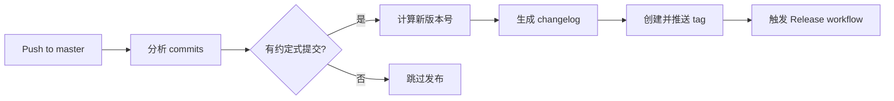
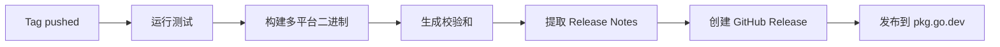

# 版本管理和发布流程 (Version Management and Release Process)

**文档版本:** 1.0
**最后更新:** 2025-11-26

---

## 概述 (Overview)

GoAgent 项目使用自动化的版本管理和发布系统，基于**语义化版本** (Semantic Versioning) 和**约定式提交** (Conventional Commits) 规范。

**关键特性:**
- 🤖 自动根据 commit 消息确定版本号
- 🏷️ 自动创建 Git tags
- 📦 自动创建 GitHub Releases
- 📝 自动生成 Release Notes
- 🔄 支持手动触发指定版本

---

## 语义化版本 (Semantic Versioning)

版本号格式: `v<major>.<minor>.<patch>`

- **MAJOR (主版本)**: 包含破坏性变更
- **MINOR (次版本)**: 新增功能，向后兼容
- **PATCH (补丁版本)**: Bug 修复，向后兼容

**示例:**
- `v1.0.0` → `v2.0.0` (破坏性变更)
- `v1.0.0` → `v1.1.0` (新功能)
- `v1.0.0` → `v1.0.1` (Bug 修复)

---

## 约定式提交规范 (Conventional Commits)

Commit 消息格式:

```
<type>(<scope>): <subject>

<body>

<footer>
```

### 必需的 Type (类型)

| Type | 版本变更 | 说明 |
|------|----------|------|
| `feat` | MINOR | 新功能 |
| `fix` | PATCH | Bug 修复 |
| `docs` | PATCH | 文档变更 |
| `refactor` | PATCH | 代码重构（不改变功能） |
| `perf` | PATCH | 性能优化 |
| `test` | PATCH | 测试相关 |
| `chore` | PATCH | 构建/工具/依赖更新 |
| `style` | PATCH | 代码风格（不影响功能） |
| `ci` | PATCH | CI/CD 配置 |
| `build` | PATCH | 构建系统 |

### 破坏性变更 (Breaking Changes)

**方式 1: 在 type 后添加 `!`**
```
feat!: redesign Agent interface

BREAKING CHANGE: Agent.Run() now requires context.Context
```

**方式 2: 在 footer 添加 BREAKING CHANGE**
```
feat(core): add new execution engine

BREAKING CHANGE: removed deprecated BaseAgent.Execute() method
```

**触发:** MAJOR 版本变更

### Commit 示例

**✅ 正确示例:**

```bash
# 新功能 (触发 MINOR 版本变更)
git commit -m "feat(llm): add support for Claude 3.5 Sonnet"

# Bug 修复 (触发 PATCH 版本变更)
git commit -m "fix(retry): prevent thundering herd on crypto/rand failure"

# 文档更新 (触发 PATCH 版本变更)
git commit -m "docs(tools): add comprehensive Shell tool documentation"

# 破坏性变更 (触发 MAJOR 版本变更)
git commit -m "feat(core)!: redesign middleware system

BREAKING CHANGE: Middleware signature changed from func(Agent) to func(Runnable)"

# 带 scope 的修复
git commit -m "fix(database): prevent SQL injection in UNION queries"

# 测试相关 (触发 PATCH 版本变更)
git commit -m "test(llm): add comprehensive retry logic tests"
```

**❌ 错误示例:**

```bash
# 缺少 type
git commit -m "add new feature"

# 大写 type（应该小写）
git commit -m "Feat: add something"

# 缺少冒号
git commit -m "feat add something"

# 非标准 type
git commit -m "update: change something"
```

---

## 自动发布工作流 (Automated Release Workflow)

### Workflow 1: Auto Tag (自动打标签)

**文件:** `.github/workflows/auto-tag.yml`

**触发条件:**
1. **自动触发:** 当代码推送到 `master` 分支时
2. **手动触发:** 通过 GitHub Actions UI 手动运行

**工作流程:**



**版本判断逻辑:**

1. 获取最新的 tag (如 `v1.2.3`)
2. 分析自上次 tag 以来的所有 commits
3. 根据 commit 类型确定版本变更:
   - 包含 `feat!:` 或 `BREAKING CHANGE:` → MAJOR (v1.2.3 → v2.0.0)
   - 包含 `feat:` → MINOR (v1.2.3 → v1.3.0)
   - 包含 `fix:`, `docs:`, 等 → PATCH (v1.2.3 → v1.2.4)
   - 无约定式提交 → 跳过发布

4. 创建新 tag 并推送

### Workflow 2: Release (创建发布)

**文件:** `.github/workflows/release.yml`

**触发条件:** 当新的 tag 推送到仓库时 (由 auto-tag 触发)

**工作流程:**



**构建产物:**

- Linux AMD64/ARM64
- macOS AMD64/ARM64 (Apple Silicon)
- Windows AMD64
- SHA256 校验和文件

---

## 使用指南 (Usage Guide)

### 场景 1: 日常开发 (自动发布)

**步骤:**

1. **创建功能分支**
   ```bash
   git checkout -b feat/add-claude-support
   ```

2. **开发并提交 (使用约定式提交)**
   ```bash
   git add .
   git commit -m "feat(llm): add Claude 3.5 Sonnet provider"
   ```

3. **推送并创建 PR**
   ```bash
   git push origin feat/add-claude-support
   # 在 GitHub 上创建 Pull Request
   ```

4. **审查并合并到 master**
   ```bash
   # PR 审查通过后，合并到 master
   # 合并时使用 "Squash and merge" 保持提交历史清晰
   ```

5. **自动发布**
   - ✅ 合并后，auto-tag workflow 自动运行
   - ✅ 根据 commit 自动确定版本号 (如 v1.3.0)
   - ✅ 创建 tag 并推送
   - ✅ release workflow 自动构建并发布

**查看发布:**
```
https://github.com/kart-io/goagent/releases
```

### 场景 2: 手动触发特定版本

**适用情况:**
- 需要跳过某些 commits 不发布
- 需要发布特定的版本号
- 紧急 hotfix 发布

**步骤:**

1. **在 GitHub Actions 页面手动触发**
   - 导航到: `Actions` → `Auto Tag and Release`
   - 点击 `Run workflow`
   - 选择版本变更类型:
     - `major` - 主版本 (v1.0.0 → v2.0.0)
     - `minor` - 次版本 (v1.0.0 → v1.1.0)
     - `patch` - 补丁版本 (v1.0.0 → v1.0.1)
     - `auto` - 自动检测（默认）

2. **等待 workflow 完成**
   - Auto-tag workflow 创建 tag
   - Release workflow 自动触发并构建

### 场景 3: Hotfix 快速发布

**步骤:**

1. **从 master 创建 hotfix 分支**
   ```bash
   git checkout master
   git pull
   git checkout -b hotfix/critical-security-fix
   ```

2. **修复并提交**
   ```bash
   git add .
   git commit -m "fix(security)!: patch critical SQL injection vulnerability

   BREAKING CHANGE: sanitizeQuery now blocks additional patterns
   This may affect existing queries that use UNION statements"
   ```

3. **直接合并到 master (经过快速审查)**
   ```bash
   git checkout master
   git merge hotfix/critical-security-fix
   git push origin master
   ```

4. **自动发布**
   - 由于包含 `!` 和 `BREAKING CHANGE`，触发 MAJOR 版本变更

### 场景 4: 批量 commits 的版本管理

**问题:** 如果 master 分支有多个 commits，应该如何确定版本？

**解决方案:** Auto-tag workflow 会分析**自上次 tag 以来的所有 commits**，选择**最高优先级**的变更类型:

**优先级:** MAJOR > MINOR > PATCH

**示例:**

```bash
# 上次 tag: v1.2.3
# 新的 commits:
- fix(retry): fix jitter fallback       # PATCH
- feat(llm): add new provider           # MINOR
- docs(tools): update README            # PATCH
- feat(core)!: breaking API change      # MAJOR

# 结果: 选择 MAJOR，新版本 v2.0.0
```

---

## 版本策略 (Versioning Strategy)

### Pre-release 版本

**格式:** `v1.2.3-alpha.1`, `v1.2.3-beta.1`, `v1.2.3-rc.1`

**创建方式:**

```bash
# 手动创建 pre-release tag
git tag -a v1.3.0-beta.1 -m "Beta release for v1.3.0"
git push origin v1.3.0-beta.1
```

**特性:**
- Release workflow 会自动检测并标记为 `prerelease`
- 不会被 `auto-tag` workflow 自动创建
- 适用于测试新功能

### 版本分支策略

**推荐的分支模型:**

```
master            (主分支，自动发布)
  ├─ feat/*       (功能分支)
  ├─ fix/*        (修复分支)
  ├─ hotfix/*     (紧急修复)
  └─ release/*    (可选：发布准备分支)
```

**分支命名规范:**
- `feat/feature-name` - 新功能
- `fix/bug-name` - Bug 修复
- `hotfix/critical-fix` - 紧急修复
- `docs/update-name` - 文档更新
- `refactor/component-name` - 重构
- `test/test-name` - 测试改进

---

## Release Notes 生成

### 自动生成的内容

Auto-tag workflow 自动生成的 Release Notes 包含:

1. **按类型分类的 commits:**
   - 🚀 Features (feat)
   - 🐛 Bug Fixes (fix)
   - 📚 Documentation (docs)
   - 🧪 Tests (test)
   - 🔧 Maintenance (chore, refactor, perf, etc.)

2. **统计信息:**
   - 总 commit 数
   - 前后版本对比

3. **链接:**
   - Full Changelog (GitHub compare view)

### 自定义 Release Notes

**方式 1: 使用 CHANGELOG.md (推荐)**

创建 `CHANGELOG.md` 文件，按以下格式编写:

```markdown
# Changelog

## [v1.3.0] - 2025-11-26

### Added
- Claude 3.5 Sonnet provider support
- Automatic retry with jitter fallback

### Fixed
- SQL injection vulnerability in database query tool
- Race condition in retry logic

### Changed
- Improved structured logging throughout the project

## [v1.2.0] - 2025-11-20
...
```

Release workflow 会自动提取对应版本的内容。

**方式 2: 手动编辑 Release**

发布后，可以在 GitHub Releases 页面手动编辑 Release Notes。

---

## 故障排查 (Troubleshooting)

### 问题 1: Auto-tag 没有创建新版本

**原因:**
- Commits 不符合约定式提交规范
- 上次 tag 之后没有新的功能或修复

**解决方案:**

1. **检查 commit 消息:**
   ```bash
   git log $(git describe --tags --abbrev=0)..HEAD --oneline
   ```

2. **确认使用约定式提交:**
   ```bash
   # 正确
   git commit -m "feat: add new feature"

   # 错误
   git commit -m "add new feature"
   ```

3. **手动触发指定版本:**
   - 在 GitHub Actions 中手动运行 `Auto Tag and Release`
   - 选择 `patch`, `minor`, 或 `major`

### 问题 2: Release 构建失败

**常见原因:**
- 测试失败
- 导入层级验证失败
- 构建错误

**解决方案:**

1. **本地验证:**
   ```bash
   make test
   make lint
   ./verify_imports.sh
   make build
   ```

2. **查看 workflow 日志:**
   - GitHub Actions → Release workflow → 查看失败步骤

3. **修复后重新推送 tag:**
   ```bash
   # 删除失败的 tag
   git tag -d v1.3.0
   git push origin :refs/tags/v1.3.0

   # 修复问题后，手动触发新版本
   ```

### 问题 3: Tag 已存在

**错误信息:** `Tag v1.3.0 already exists`

**解决方案:**

**选项 1: 删除并重新创建 (谨慎使用)**
```bash
# 本地删除
git tag -d v1.3.0

# 远程删除
git push origin :refs/tags/v1.3.0

# 重新触发 auto-tag
```

**选项 2: 手动创建下一个版本**
```bash
# 跳过 v1.3.0，直接创建 v1.3.1
git tag -a v1.3.1 -m "Release v1.3.1"
git push origin v1.3.1
```

### 问题 4: pkg.go.dev 没有更新

**原因:** pkg.go.dev 索引需要时间

**解决方案:**

1. **等待几分钟** (通常 5-15 分钟)

2. **手动触发索引:**
   ```bash
   curl https://proxy.golang.org/github.com/kart-io/goagent/@v/v1.3.0.info
   ```

3. **访问包页面:**
   ```
   https://pkg.go.dev/github.com/kart-io/goagent@v1.3.0
   ```

---

## 最佳实践 (Best Practices)

### 1. Commit 消息规范

**Do:**
- ✅ 使用小写的 type
- ✅ 简洁的 subject (< 72 字符)
- ✅ 使用英文撰写
- ✅ 在 body 中详细说明变更
- ✅ 引用相关 issue (#123)

**Don't:**
- ❌ 混合多种变更类型
- ❌ 过于笼统的描述 ("update code")
- ❌ 大写 type ("Feat:")
- ❌ 忘记冒号 ("feat add")

### 2. 版本发布频率

**推荐策略:**

- **PATCH 版本:** 随时发布（Bug 修复）
- **MINOR 版本:** 每 1-2 周（新功能积累）
- **MAJOR 版本:** 谨慎发布（破坏性变更）

### 3. 破坏性变更

**原则:**

1. **尽量避免** - 优先使用 deprecation 过渡
2. **充分沟通** - 在 Release Notes 中详细说明
3. **提供迁移指南** - 帮助用户升级

**示例:**

```markdown
## BREAKING CHANGES in v2.0.0

### Middleware Signature Changed

**Before:**
```go
func MyMiddleware(agent Agent) Agent
```

**After:**
```go
func MyMiddleware(next Runnable[I, O]) Runnable[I, O]
```

**Migration Guide:**
1. Update middleware signature
2. Use type parameters instead of concrete types
3. See examples in `middleware/` directory
```

### 4. Pre-release 测试

**流程:**

1. 创建 pre-release tag:
   ```bash
   git tag -a v1.3.0-rc.1 -m "Release Candidate 1 for v1.3.0"
   git push origin v1.3.0-rc.1
   ```

2. 部署到测试环境

3. 收集反馈

4. 修复问题并创建新的 RC:
   ```bash
   git tag -a v1.3.0-rc.2 -m "Release Candidate 2 for v1.3.0"
   ```

5. 稳定后发布正式版本 (自动或手动)

---

## CI/CD 集成 (CI/CD Integration)

### 与其他 Workflows 的关系

```
┌─────────────────┐
│   PR Workflow   │  (pr.yml)
└────────┬────────┘
         │
         ↓
┌─────────────────┐
│  CI Workflow    │  (ci.yml) - master 分支推送
└────────┬────────┘
         │
         ↓
┌─────────────────┐
│ Auto Tag WF     │  (auto-tag.yml) - 自动创建 tag
└────────┬────────┘
         │
         ↓
┌─────────────────┐
│ Release WF      │  (release.yml) - 构建和发布
└─────────────────┘
```

### 环境变量和 Secrets

**必需的 Secrets:**

- `GITHUB_TOKEN` - 自动提供，用于创建 releases
- `CODECOV_TOKEN` - (可选) 用于上传覆盖率

**不需要额外配置** - GitHub Actions 自动提供必要的权限。

---

## 监控和报告 (Monitoring and Reporting)

### GitHub Actions Dashboard

**查看位置:** `https://github.com/kart-io/goagent/actions`

**关键指标:**
- ✅ Workflow 成功率
- ⏱️ 平均执行时间
- 📦 Release 频率

### Release 统计

**可用数据:**
- 版本发布历史
- 每个版本的下载量
- 各平台构建产物使用情况

**查看:** `https://github.com/kart-io/goagent/releases`

---

## 附录 A: Commit Message 模板

创建 `.gitmessage` 文件:

```
# <type>(<scope>): <subject>
# |<----  Using a Maximum Of 50 Characters  ---->|

# Explain why this change is being made
# |<----   Try To Limit Each Line to a Maximum Of 72 Characters   ---->|

# Provide links or keys to any relevant tickets, articles or other resources
# Example: Fixes #23

# --- COMMIT END ---
# Type can be:
#   feat     (new feature)
#   fix      (bug fix)
#   docs     (changes to documentation)
#   style    (formatting, missing semi colons, etc; no code change)
#   refactor (refactoring production code)
#   test     (adding missing tests, refactoring tests; no production code change)
#   chore    (updating build tasks, package manager configs, etc; no production code change)
#   perf     (performance improvement)
#   ci       (CI/CD related changes)
#   build    (build system changes)
# --------------------
# Breaking changes must be indicated by "!" after the type/scope
# or "BREAKING CHANGE:" in the footer
# --------------------
# Remember to:
#   - Capitalize the subject line
#   - Use the imperative mood in the subject line
#   - Do not end the subject line with a period
#   - Separate subject from body with a blank line
#   - Use the body to explain what and why vs. how
#   - Can use multiple lines with "-" for bullet points in body
# --------------------
```

配置:
```bash
git config commit.template .gitmessage
```

---

## 附录 B: 快速参考 (Quick Reference)

### Commit Types 速查表

| Type | 版本 | 示例 |
|------|------|------|
| `feat` | MINOR | `feat(llm): add Claude support` |
| `fix` | PATCH | `fix(retry): handle crypto/rand failure` |
| `feat!` | MAJOR | `feat!: redesign Agent interface` |
| `docs` | PATCH | `docs: update README` |
| `test` | PATCH | `test(llm): add retry tests` |
| `refactor` | PATCH | `refactor(core): simplify executor` |

### 常用命令

```bash
# 查看最新 tag
git describe --tags --abbrev=0

# 查看自上次 tag 以来的 commits
git log $(git describe --tags --abbrev=0)..HEAD --oneline

# 创建并推送 tag
git tag -a v1.3.0 -m "Release v1.3.0"
git push origin v1.3.0

# 删除本地和远程 tag
git tag -d v1.3.0
git push origin :refs/tags/v1.3.0

# 查看 tag 详情
git show v1.3.0

# 检查 commit 消息格式
git log --oneline -10 | grep -E "^[a-z0-9]+ (feat|fix|docs|test|refactor|perf|chore|style|ci|build)(\(.+\))?:"
```

---

## 相关文档 (Related Documentation)

- [Contributing Guide](CONTRIBUTING.md)
- [Code Review Checklist](CODE_REVIEW_CHECKLIST.md)
- [Testing Best Practices](docs/development/TESTING_BEST_PRACTICES.md)
- [GitHub Actions Workflows](.github/workflows/README.md)

---

## 支持和反馈 (Support and Feedback)

**问题报告:**
- GitHub Issues: https://github.com/kart-io/goagent/issues

**功能请求:**
- GitHub Discussions: https://github.com/kart-io/goagent/discussions

**紧急支持:**
- 联系维护团队

---

**文档维护者:** GoAgent Team
**最后审查:** 2025-11-26
**下次审查:** 2026-01-26
